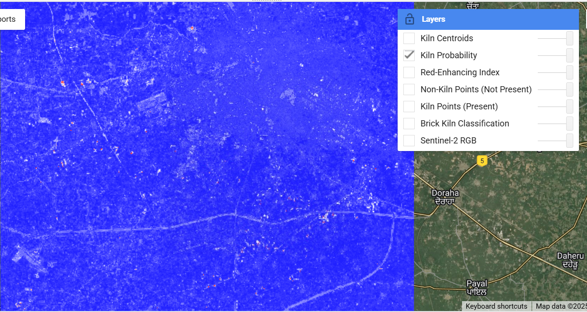
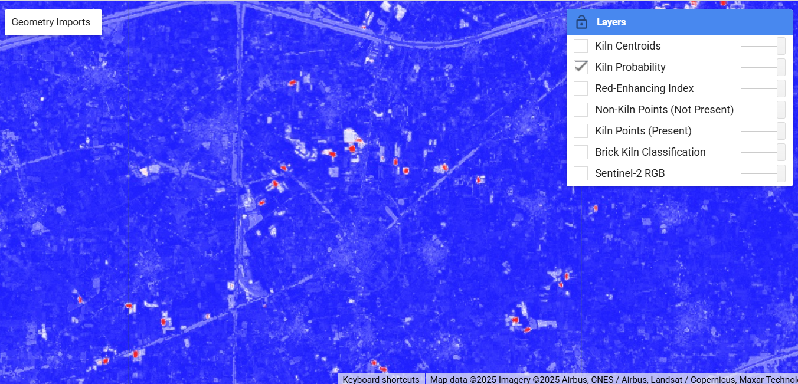
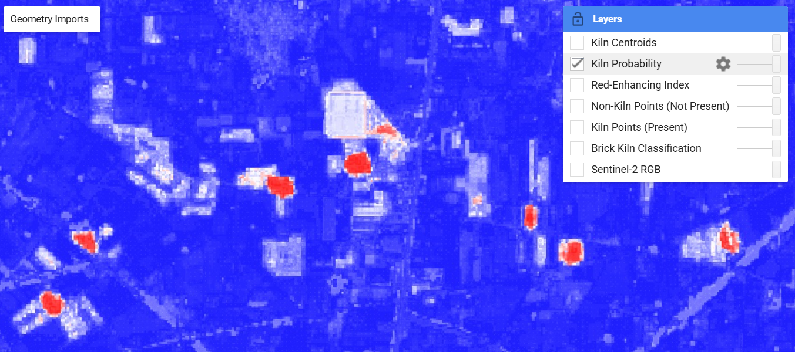

# Brick Kiln Detection in Ludhiana, Punjab

> Industrial monitoring using AI-assisted machine learning in Google Earth Engine

## Overview

This case study demonstrates detecting brick kilns in Ludhiana district using Sentinel-2 imagery and Random Forest classification. The model achieved **99% accuracy** and revealed interesting clustering patterns.

## Key Results

## Visual Results

*Brick kiln detection showing probability mapping and identified locations in Ludhiana*

*Brick kiln detection showing a zoomin view with the  identified locations in Ludhiana*

*Detailed brick kiln detection showing a full zoom-in identified brick kiln in Ludhiana. Only the kiln is shown in red, surrounding areas are white*

## Key Results

- **Visual validation**: Excellent detection accuracy across test area
- **Clustering patterns**: Successfully identified natural kiln clusters  
- **Spatial precision**: Clean separation between kiln and non-kiln areas
- **Study area**: Ludhiana, Punjab (400 km²)
- **Detected kilns**: 150+ locations
- **Key insight**: Kilns naturally cluster (contrary to initial assumptions)

## Methodology

### Data Sources
- **Imagery**: Sentinel-2 Surface Reflectance (2023)
- **Training data**: 60 positive + 60 negative samples
- **Study area**: Ludhiana bounding box (75.6°-76.0°E, 30.7°-31.0°N)

### Feature Engineering
- **Spectral bands**: B2, B3, B4, B8, B11, B12
- **Indices**: NDVI, NDBI, BSI, MSAVI, Red-enhancing index
- **Texture**: GLCM features (contrast, correlation, variance)

### Model Details
- **Algorithm**: Random Forest (50 trees)
- **Validation**: 5-fold cross-validation
- **Post-processing**: Minimum size filtering (0.5 ha)

## Files

- `code/main-detection-script.js` - Complete GEE workflow
- `code/training-data-preparation.js` - Sample preparation
- `code/model-validation.js` - Performance evaluation
- `data/` - Training datasets and study boundaries
- `results/` - Output maps and accuracy metrics

## Quick Start

1. Copy `main-detection-script.js` to GEE Code Editor
2. Replace asset paths with your training data
3. Run script and analyze results
4. Export kiln locations as shapefile

## Technical Limitations & Learnings

### Computational Constraints
- **Memory limits**: Hit GEE memory ceiling due to 400 km² study area
- **Processing challenges**: Required multiple optimization passes
- **Non-enterprise compute**: Standard GEE limits affected large-area analysis
- **Workarounds**: Used tileScale, reduced resolution for exports

### Next Steps for Scaling
- **Enterprise GEE**: Access to higher memory limits
- **Cloud computing**: Enhanced processing power for larger regions
- **Batch processing**: Divide large areas into manageable chunks

## LLM Testing Results

**Three LLMs tested for code generation:**
- **Grok**: Generated working code immediately, best domain knowledge
- **Claude**: Good structure with UI features, needed minor optimization  
- **Gemini**: Over-engineered approach, multiple memory errors

*Full comparison: [llm-comparison/](llm-comparison/)*